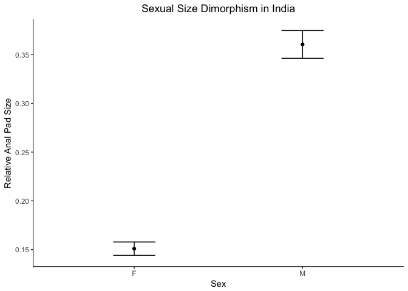
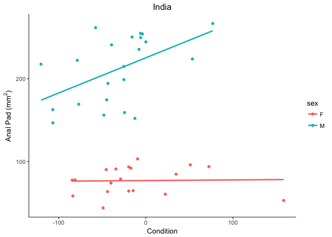

Rapid evolution of a sexually selected trait
================

``` r
## Read in data
## Create male and female subsets
## Create a subset just for those individuals from India
## Create male and female subsets for individuals from India
mongoose = read.csv("all mongoose data.csv")
male = subset(mongoose, sex =="M")
female = subset(mongoose, sex =="F")
india = subset(mongoose, location =="India")
india.m = subset(india, sex =="M")
india.f = subset(india, sex =="F")
```

``` r
## Creates a function to display count, mean, standard deviation, standard error, and 95% CI
summarySE = function(data=NULL, measurevar, groupvars=NULL, na.rm=FALSE,
                      conf.interval=.95, .drop=TRUE) {
    library(plyr)

    length2 = function (x, na.rm=FALSE) {
        if (na.rm) sum(!is.na(x))
        else       length(x)
    }

    datac <- ddply(data, groupvars, .drop=.drop,
      .fun = function(xx, col) {
        c(N    = length2(xx[[col]], na.rm=na.rm),
          mean = mean   (xx[[col]], na.rm=na.rm),
          sd   = sd     (xx[[col]], na.rm=na.rm)
        )
      },
      measurevar
    )
   
    datac <- rename(datac, c("mean" = measurevar))

    datac$se <- datac$sd / sqrt(datac$N)  

    ciMult <- qt(conf.interval/2 + .5, datac$N-1)
    datac$ci <- datac$se * ciMult

    return(datac)
}
```

Investigate features from the native range of India
===================================================

### The anal pad is an important tool for scent marking, a behavior thought to be used in mate attraction

``` r
## uses function to summarize descriptive statistics of the trait "ap.c"
## and puts them into plot-able (long) format.
## "ap.c" is the size of the animal's scent-marking tool, the anal pad, 
## after controlling for body length
india_plot_data = summarySE(india, measurevar = "ap.c", groupvars = "sex")
print(india_plot_data)
```

    ##   sex  N      ap.c         sd          se         ci
    ## 1   F 19 0.1509505 0.02987241 0.006853201 0.01439804
    ## 2   M 23 0.3604562 0.06824933 0.014230968 0.02951322

``` r
## loads ggplot
library(ggplot2)

## To understand the data, we should first visualize them
## This plots means and standard errors of both sexes on same plot
ggplot(india_plot_data, aes(x = sex, y = ap.c)) + 
    geom_errorbar(aes(ymin = ap.c-se, ymax = ap.c + se), width = 0.25) + 
    geom_point() +
    labs(x = "Sex", y = "Relative Anal Pad Size", title = "Sexual Size Dimorphism in India") + 
    theme_bw() + 
    theme(
        panel.border = element_blank(), panel.grid.major = element_blank(), 
        panel.grid.minor = element_blank(), axis.line.x = element_line(color = "black"), 
        axis.line.y = element_line(color = "black"), plot.title = element_text(hjust = 0.5))
```



``` r
## The plot clearly shows a sex difference, but we need to be sure.
## Sexual dimorphism is often a hallmark of a sexually selected trait.
## The code first uses an F-test to test for homogeneity of variance between males and females,
## then, based on the results, performs the appropriate t-test to compare means.
if (var.test(india.m$ap.c, india.f$ap.c)$p.value < 0.05) {
  t.test(india.m$ap.c, india.f$ap.c, var = F)
} else 
  t.test(india.m$ap.c, india.m$ap.c, var = T)
```

    ## 
    ##  Welch Two Sample t-test
    ## 
    ## data:  india.m$ap.c and india.f$ap.c
    ## t = 13.264, df = 31.328, p-value = 2.139e-14
    ## alternative hypothesis: true difference in means is not equal to 0
    ## 95 percent confidence interval:
    ##  0.1773049 0.2417065
    ## sample estimates:
    ## mean of x mean of y 
    ## 0.3604562 0.1509505

``` r
## The t-test revealed that males do indeed posess larger anal pads.
## Now to provide more evidence that this trait is under sexual selection,
## we want to determine if it is related to individual condition in males and not females.
## Let's visualize the data by plotting anal pad size and condition for both sexes on same graph:
ggplot(india, aes(x = cond2, y = ap, color = sex)) +
    geom_point() +
    geom_smooth(method = lm, se = F) +
    labs(
        x = "Condition",  y = (bquote("Anal Pad ("*mm^2*")")), title = "India") + 
    theme_bw() + 
    theme(
        panel.border = element_blank(), panel.grid.major = element_blank(), 
        panel.grid.minor = element_blank(), axis.line.x = element_line(color = "black"), 
        axis.line.y = element_line(color = "black"), plot.title = element_text(hjust = 0.5))
```

    ## Warning: Removed 1 rows containing non-finite values (stat_smooth).

    ## Warning: Removed 1 rows containing missing values (geom_point).



``` r
## The warning message is because one individual's condition metric could not be calculated
```

``` r
## There does appear to be a difference in slopes, but to be sure, we need to perform
## an ANCOVA (analysis of covariance) to determine if the slopes differ by sex
summary(aov(ap~cond2*sex, data = india))
```

    ##             Df Sum Sq Mean Sq F value Pr(>F)    
    ## cond2        1    431     431   0.516 0.4769    
    ## sex          1 187598  187598 224.703 <2e-16 ***
    ## cond2:sex    1   4780    4780   5.725 0.0219 *  
    ## Residuals   37  30890     835                   
    ## ---
    ## Signif. codes:  0 '***' 0.001 '**' 0.01 '*' 0.05 '.' 0.1 ' ' 1
    ## 1 observation deleted due to missingness

``` r
## And the interaction term "cond2:sex" is indeed significant, suggesting the trait
## is condition dependent in males but not females.
```

Compare native range to introduced range
========================================

To determine if any changes have occured since introduction
-----------------------------------------------------------

``` r
## summarizes the global data for "ap.c" and puts it into plot-able (long) form
global_plot_data = summarySE(mongoose, measurevar = "ap.c", groupvars = c("sex", "location"))
```

``` r
## plots means and st.err of both sexes on same plot
ggplot(global_plot_data, aes(x = location, y = ap.c, color = sex)) + 
    geom_errorbar(aes(ymin = ap.c-se, ymax = ap.c + se), width = 0.25) + 
    geom_point() + 
    scale_x_discrete(limits=c("India","Mauritius","St. Croix","Hawaii","Jamaica")) + 
    labs(
        x = "Location", y = "Relative Anal Pad", title = "Global Comparison") + 
    theme_bw() + 
    theme(panel.border = element_blank(), panel.grid.major = element_blank(), 
          panel.grid.minor = element_blank(), axis.line.x = element_line(color = "black"), 
          axis.line.y = element_line(color = "black"), plot.title = element_text(hjust = 0.5))
```


``` r
## analysis of variance between males
summary(aov(ap.c~location, data = male))
```

    ##              Df Sum Sq Mean Sq F value Pr(>F)    
    ## location      4 0.2657 0.06642   26.31 <2e-16 ***
    ## Residuals   144 0.3635 0.00252                   
    ## ---
    ## Signif. codes:  0 '***' 0.001 '**' 0.01 '*' 0.05 '.' 0.1 ' ' 1

``` r
## post hoc, pairwise comparisons between locations for males
TukeyHSD(aov(ap.c~location, data = male))
```

    ##   Tukey multiple comparisons of means
    ##     95% family-wise confidence level
    ## 
    ## Fit: aov(formula = ap.c ~ location, data = male)
    ## 
    ## $location
    ##                             diff          lwr          upr     p adj
    ## India-Hawaii         0.118515024  0.080812237  0.156217811 0.0000000
    ## Jamaica-Hawaii      -0.004557092 -0.039572001  0.030457817 0.9963906
    ## Mauritius-Hawaii     0.039757922 -0.002526599  0.082042442 0.0761373
    ## St. Croix-Hawaii     0.007522022 -0.024001841  0.039045884 0.9646522
    ## Jamaica-India       -0.123072116 -0.161541366 -0.084602866 0.0000000
    ## Mauritius-India     -0.078757102 -0.123943605 -0.033570600 0.0000359
    ## St. Croix-India     -0.110993002 -0.146314288 -0.075671717 0.0000000
    ## Mauritius-Jamaica    0.044315014  0.001345679  0.087284348 0.0396622
    ## St. Croix-Jamaica    0.012079114 -0.020357547  0.044515775 0.8416731
    ## St. Croix-Mauritius -0.032235900 -0.072411436  0.007939637 0.1794531

``` r
## analysis of variance between females
summary(aov(ap.c~location, data = female))
```

    ##              Df  Sum Sq   Mean Sq F value Pr(>F)  
    ## location      4 0.00754 0.0018857    2.44 0.0513 .
    ## Residuals   106 0.08192 0.0007728                 
    ## ---
    ## Signif. codes:  0 '***' 0.001 '**' 0.01 '*' 0.05 '.' 0.1 ' ' 1

``` r
## plots relationship of anal pad and condition for each location for males
ggplot(male, aes(x = cond2, y = ap, color = location, shape = location)) + 
    geom_point() + 
    scale_color_manual(name = "Location", labels = c("Hawaii", "India", "Jamaica", "Mauritius", "St. Croix"), values = c(1,2,3,4,5)) + 
    scale_shape_manual(name = "Location", labels = c("Hawaii", "India", "Jamaica", "Mauritius", "St. Croix"), values = c(1,2,3,4,5)) + 
    geom_smooth(method = lm, se = F) + 
    labs(
        x = "Condition" ,  y = (bquote("Anal Pad ("*mm^2*")")), title = "Males") + 
    theme_bw() + 
    theme(
        panel.border = element_blank(), panel.grid.major = element_blank(), 
        panel.grid.minor = element_blank(), axis.line.x = element_line(color = "black"), 
        axis.line.y = element_line(color = "black"), plot.title = element_text(hjust = 0.5))
```

    ## Warning: Removed 4 rows containing non-finite values (stat_smooth).

    ## Warning: Removed 4 rows containing missing values (geom_point).


``` r
## ancova: do the different populations of males have significantly different relationships between anal pad and body condition?
summary(aov(ap.c~cond2*location, data = male))
```

    ##                 Df  Sum Sq Mean Sq F value  Pr(>F)    
    ## cond2            1 0.01897 0.01897   9.717 0.00223 ** 
    ## location         4 0.31101 0.07775  39.819 < 2e-16 ***
    ## cond2:location   4 0.01978 0.00494   2.532 0.04324 *  
    ## Residuals      135 0.26361 0.00195                    
    ## ---
    ## Signif. codes:  0 '***' 0.001 '**' 0.01 '*' 0.05 '.' 0.1 ' ' 1
    ## 4 observations deleted due to missingness

``` r
## plots relationship of anal pad and condition for each location for females
ggplot(female, aes(x = cond2, y = ap, color = location, shape = location)) + 
    geom_point() + 
    scale_color_manual(name = "Location", labels = c("Hawaii", "India", "Jamaica", "Mauritius", "St. Croix"), values = c(1,2,3,4,5)) + 
    scale_shape_manual(name = "Location", labels = c("Hawaii", "India", "Jamaica", "Mauritius", "St. Croix"), values = c(1,2,3,4,5)) + 
    geom_smooth(method = lm, se = F) + 
    labs(
        x = "Condition",  y = (bquote("Anal Pad ("*mm^2*")")), title = "Females") + 
    theme_bw() + 
    theme(
        panel.border = element_blank(), panel.grid.major = element_blank(), 
        panel.grid.minor = element_blank(), axis.line.x = element_line(color = "black"), 
        axis.line.y = element_line(color = "black"), plot.title = element_text(hjust = 0.5))
```


``` r
## ancova: do the different populations of females have significantly different relationships between anal pad and body condition?
summary(aov(ap.c~cond2*location, data = female))
```

    ##                 Df  Sum Sq   Mean Sq F value Pr(>F)  
    ## cond2            1 0.00087 0.0008673   1.082 0.3007  
    ## location         4 0.00674 0.0016843   2.102 0.0861 .
    ## cond2:location   4 0.00091 0.0002279   0.284 0.8875  
    ## Residuals      101 0.08095 0.0008015                 
    ## ---
    ## Signif. codes:  0 '***' 0.001 '**' 0.01 '*' 0.05 '.' 0.1 ' ' 1
