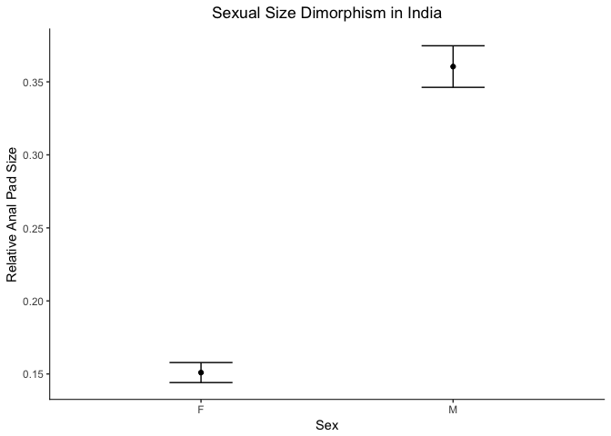
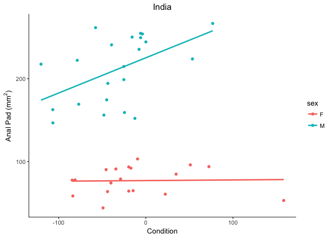
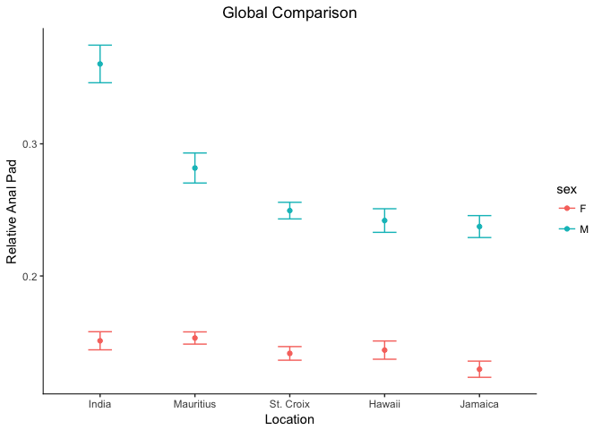
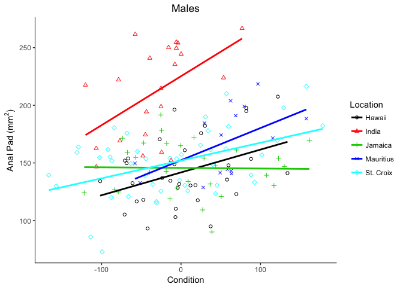
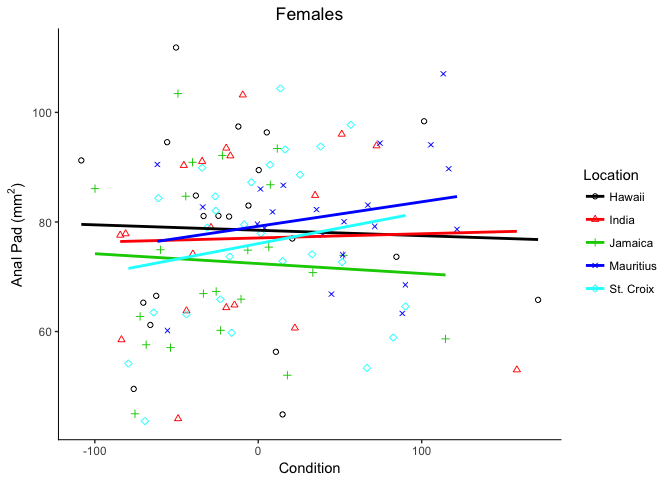

Rapid evolution of a sexually selected trait
================

Step 1: Prepare data
--------------------

``` r
## Read in data
## Create male and female subsets
## Create a subset just for those individuals from India
## Create male and female subsets for individuals from India
mongoose = read.csv("all mongoose data.csv")
male = subset(mongoose, sex =="M")
female = subset(mongoose, sex =="F")
india = subset(mongoose, location =="India")
india.m = subset(india, sex =="M")
india.f = subset(india, sex =="F")
```

``` r
## Creates a function to display count, mean, standard deviation, standard error, and 95% CI
summarySE = function(data = NULL, measurevar, groupvars = NULL, na.rm = FALSE,
                      conf.interval = .95, .drop = TRUE) {
    library(plyr)

    length2 = function (x, na.rm = FALSE) {
        if (na.rm) sum(!is.na(x))
        else length(x)
    }

    datac = ddply(data, groupvars, .drop = .drop,
      .fun = function(xx, col) {
        c(N    = length2(xx[[col]], na.rm = na.rm),
          mean = mean   (xx[[col]], na.rm = na.rm),
          sd   = sd     (xx[[col]], na.rm = na.rm)
        )
      },
      measurevar
    )
   
    datac = rename(datac, c("mean" = measurevar))

    datac$se = datac$sd / sqrt(datac$N)  

    ciMult = qt(conf.interval/2 + .5, datac$N-1)
    datac$ci = datac$se * ciMult

    return(datac)
}
```

Step 2: Investigate features from the native range of India
-----------------------------------------------------------

#### Sexual dimorphism in traits and their characteristics is often a hallmark of sexual selection

#### The anal pad is an important tool for scent marking, a behavior thought to be used by males to attract mates

``` r
## Uses the newly created "summarySE" function to summarize data of the trait "ap.c"
## and puts the results into a plot-able (long) format.
## The variable "ap.c" is the size of the anal pad, after correcting for body length.
## This correction is necessary to allow for a comparison between males and females,
## because the anal pad is related to body size and males are larger than females.
india_plot_data = summarySE(india, measurevar = "ap.c", groupvars = "sex")
print(india_plot_data)
```

    ##   sex  N      ap.c         sd          se         ci
    ## 1   F 19 0.1509505 0.02987241 0.006853201 0.01439804
    ## 2   M 23 0.3604562 0.06824933 0.014230968 0.02951322

#### Visualize the data

``` r
## loads ggplot
library(ggplot2)

## This plots means and standard errors of both sexes on same the plot
ggplot(india_plot_data, aes(x = sex, y = ap.c)) + 
    geom_errorbar(aes(ymin = ap.c-se, ymax = ap.c + se), width = 0.25) + 
    geom_point() +
    labs(x = "Sex", y = "Relative Anal Pad Size", title = "Sexual Size Dimorphism in India") + 
    theme_bw() + 
    theme(
        panel.border = element_blank(), panel.grid.major = element_blank(), 
        panel.grid.minor = element_blank(), axis.line.x = element_line(color = "black"), 
        axis.line.y = element_line(color = "black"), plot.title = element_text(hjust = 0.5))
```



``` r
## The plot clearly shows a sex difference, but we need to be sure
```

#### Apply statistics

``` r
## The code first uses an F-test to test for homogeneity of variance between males and females,
## then, based on the results, performs the appropriate t-test to compare means.
if (var.test(india.m$ap.c, india.f$ap.c)$p.value < 0.05) {
  t.test(india.m$ap.c, india.f$ap.c, var = F)
} else 
  t.test(india.m$ap.c, india.m$ap.c, var = T)
```

    ## 
    ##  Welch Two Sample t-test
    ## 
    ## data:  india.m$ap.c and india.f$ap.c
    ## t = 13.264, df = 31.328, p-value = 2.139e-14
    ## alternative hypothesis: true difference in means is not equal to 0
    ## 95 percent confidence interval:
    ##  0.1773049 0.2417065
    ## sample estimates:
    ## mean of x mean of y 
    ## 0.3604562 0.1509505

``` r
## The very small p-value reveals that males do indeed possess larger anal pads.
```

#### More evidence: visualize sexual dimorphism in the relationship between the anal pad and body condition

``` r
## Now to provide more evidence that this trait is under sexual selection,
## we want to determine if it is related to body condition in males and not females,
## as this is a much stronger indicator of sexual selection than sexual size dimorphism alone.
## Let's visualize the data by plotting anal pad size and condition for both sexes on the same graph:
ggplot(india, aes(x = cond2, y = ap, color = sex)) +
    geom_point() +
    geom_smooth(method = lm, se = F) +
    labs(
        x = "Condition",  y = (bquote("Anal Pad ("*mm^2*")")), title = "India") + 
    theme_bw() + 
    theme(
        panel.border = element_blank(), panel.grid.major = element_blank(), 
        panel.grid.minor = element_blank(), axis.line.x = element_line(color = "black"), 
        axis.line.y = element_line(color = "black"), plot.title = element_text(hjust = 0.5))
```

    ## Warning: Removed 1 rows containing non-finite values (stat_smooth).

    ## Warning: Removed 1 rows containing missing values (geom_point).



``` r
## The warning message is because one individual's condition metric could not be calculated.

## There definitely appears to be a difference in the two lines, but we need to be sure.
```

#### Apply more statistics

``` r
## Let's first do a linear regression for each sex:
## First males:
summary(lm(india.m$ap~india.m$cond2))
```

    ## 
    ## Call:
    ## lm(formula = india.m$ap ~ india.m$cond2)
    ## 
    ## Residuals:
    ##     Min      1Q  Median      3Q     Max 
    ## -67.793 -23.930   4.512  30.444  60.865 
    ## 
    ## Coefficients:
    ##               Estimate Std. Error t value Pr(>|t|)    
    ## (Intercept)   225.2646     9.3539  24.083 3.03e-16 ***
    ## india.m$cond2   0.4251     0.1640   2.592   0.0174 *  
    ## ---
    ## Signif. codes:  0 '***' 0.001 '**' 0.01 '*' 0.05 '.' 0.1 ' ' 1
    ## 
    ## Residual standard error: 35.96 on 20 degrees of freedom
    ##   (1 observation deleted due to missingness)
    ## Multiple R-squared:  0.2515, Adjusted R-squared:  0.2141 
    ## F-statistic:  6.72 on 1 and 20 DF,  p-value: 0.01741

``` r
## We see the p-vale is significant, and our R2 value is a little over 25%
## Thus, body condition does predict anal pad size in males.

## Now females:
summary(lm(india.f$ap~india.f$cond2))
```

    ## 
    ## Call:
    ## lm(formula = india.f$ap ~ india.f$cond2)
    ## 
    ## Residuals:
    ##     Min      1Q  Median      3Q     Max 
    ## -32.608 -12.761   1.391  14.680  26.178 
    ## 
    ## Coefficients:
    ##                Estimate Std. Error t value Pr(>|t|)    
    ## (Intercept)   77.082009   4.032215  19.117 6.25e-13 ***
    ## india.f$cond2  0.007656   0.068050   0.113    0.912    
    ## ---
    ## Signif. codes:  0 '***' 0.001 '**' 0.01 '*' 0.05 '.' 0.1 ' ' 1
    ## 
    ## Residual standard error: 17.2 on 17 degrees of freedom
    ## Multiple R-squared:  0.000744,   Adjusted R-squared:  -0.05804 
    ## F-statistic: 0.01266 on 1 and 17 DF,  p-value: 0.9117

``` r
## We see there is no significant relationship between anal pad size and body condition.
```

``` r
## Let's take this a step farther, and compare the slopes of the line.
## Here I use an ANCOVA (analysis of covariance) to determine differences
## in slopes. Or, put another way, if the relationship between
## anal pad size and body condition co-varies with sex.
summary(aov(ap~cond2*sex, data = india))
```

    ##             Df Sum Sq Mean Sq F value Pr(>F)    
    ## cond2        1    431     431   0.516 0.4769    
    ## sex          1 187598  187598 224.703 <2e-16 ***
    ## cond2:sex    1   4780    4780   5.725 0.0219 *  
    ## Residuals   37  30890     835                   
    ## ---
    ## Signif. codes:  0 '***' 0.001 '**' 0.01 '*' 0.05 '.' 0.1 ' ' 1
    ## 1 observation deleted due to missingness

``` r
## And the interaction term "cond2:sex" is indeed significant.
```

#### Conclusion: Following sexual selection theory, I have pretty strong indirect evidence that the anal pad is under sexual selection in males but not females

Step 3: Compare native range to introduced range
================================================

#### Prepare the data

``` r
## Summarizes the global data for "ap.c" and puts them into a plot-able (long) form.
global_plot_data = summarySE(mongoose, measurevar = "ap.c", groupvars = c("sex", "location"))
print(global_plot_data)
```

    ##    sex  location  N      ap.c         sd          se          ci
    ## 1    F    Hawaii 21 0.1438928 0.03161019 0.006897908 0.014388784
    ## 2    F     India 19 0.1509505 0.02987241 0.006853201 0.014398040
    ## 3    F   Jamaica 22 0.1294248 0.02873154 0.006125585 0.012738852
    ## 4    F Mauritius 22 0.1530527 0.02168637 0.004623549 0.009615197
    ## 5    F St. Croix 27 0.1414002 0.02679135 0.005155998 0.010598306
    ## 6    M    Hawaii 33 0.2419411 0.05132566 0.008934650 0.018199287
    ## 7    M     India 23 0.3604562 0.06824933 0.014230968 0.029513222
    ## 8    M   Jamaica 30 0.2373840 0.04552360 0.008311434 0.016998791
    ## 9    M Mauritius 16 0.2816991 0.04544050 0.011360126 0.024213535
    ## 10   M St. Croix 47 0.2494632 0.04315303 0.006294516 0.012670204

#### Visualize the data

``` r
## plots means and standard errors of both sexes on same plot
ggplot(global_plot_data, aes(x = location, y = ap.c, color = sex)) + 
    geom_errorbar(aes(ymin = ap.c-se, ymax = ap.c + se), width = 0.25) + 
    geom_point() + 
    scale_x_discrete(limits=c("India","Mauritius","St. Croix","Hawaii","Jamaica")) + 
    labs(
        x = "Location (ordered by time since introduction)", y = "Relative Anal Pad",
        title = "Global Sexual Size Dimorphism") + 
    theme_bw() + 
    theme(panel.border = element_blank(), panel.grid.major = element_blank(), 
          panel.grid.minor = element_blank(), axis.line.x = element_line(color = "black"), 
          axis.line.y = element_line(color = "black"), plot.title = element_text(hjust = 0.5))
```



``` r
## Notice that male anal pads seem to gradually get smaller based on the 
## length of time since introduction.
## Female anal pads do not appear to have changed.
```

#### Apply statistics

``` r
## Perform an ANOVA (anlysis of variance) to determine if males differ in the size of their
## anal pad across locations.
summary(aov(ap.c~location, data = male))
```

    ##              Df Sum Sq Mean Sq F value Pr(>F)    
    ## location      4 0.2657 0.06642   26.31 <2e-16 ***
    ## Residuals   144 0.3635 0.00252                   
    ## ---
    ## Signif. codes:  0 '***' 0.001 '**' 0.01 '*' 0.05 '.' 0.1 ' ' 1

``` r
## The ANOVA's p-value shows that there is a significant difference between locations
## but we need a post hoc, pairwise comparisons between locations to know which specific 
## locations are different from each other.
TukeyHSD(aov(ap.c~location, data = male))
```

    ##   Tukey multiple comparisons of means
    ##     95% family-wise confidence level
    ## 
    ## Fit: aov(formula = ap.c ~ location, data = male)
    ## 
    ## $location
    ##                             diff          lwr          upr     p adj
    ## India-Hawaii         0.118515024  0.080812237  0.156217811 0.0000000
    ## Jamaica-Hawaii      -0.004557092 -0.039572001  0.030457817 0.9963906
    ## Mauritius-Hawaii     0.039757922 -0.002526599  0.082042442 0.0761373
    ## St. Croix-Hawaii     0.007522022 -0.024001841  0.039045884 0.9646522
    ## Jamaica-India       -0.123072116 -0.161541366 -0.084602866 0.0000000
    ## Mauritius-India     -0.078757102 -0.123943605 -0.033570600 0.0000359
    ## St. Croix-India     -0.110993002 -0.146314288 -0.075671717 0.0000000
    ## Mauritius-Jamaica    0.044315014  0.001345679  0.087284348 0.0396622
    ## St. Croix-Jamaica    0.012079114 -0.020357547  0.044515775 0.8416731
    ## St. Croix-Mauritius -0.032235900 -0.072411436  0.007939637 0.1794531

``` r
## Notice: 1) all locations are different from India, 2) no introduced locations are different
## except the Mauritius-Jamaica comparison. This is because there is a big difference between
## these locations with respect to the time that mongooses have been present. 
## This gradual, uniform change suggests it is a product of adaptation (i.e., evolution).
```

``` r
## analysis of variance between females
summary(aov(ap.c~location, data = female))
```

    ##              Df  Sum Sq   Mean Sq F value Pr(>F)  
    ## location      4 0.00754 0.0018857    2.44 0.0513 .
    ## Residuals   106 0.08192 0.0007728                 
    ## ---
    ## Signif. codes:  0 '***' 0.001 '**' 0.01 '*' 0.05 '.' 0.1 ' ' 1

``` r
## Although approaching significance, there is no difference between anal pads of females 
## from different locations.
```

#### Visualize the data: any change in condition-dependence?

``` r
## Is there a difference in the relationship between anal pad size and body condition
## in males across locations?
ggplot(male, aes(x = cond2, y = ap, color = location, shape = location)) + 
    geom_point() + 
    scale_color_manual(name = "Location", labels = c("Hawaii", "India", "Jamaica", 
                                                     "Mauritius", "St. Croix"), values = c(1,2,3,4,5)) + 
    scale_shape_manual(name = "Location", labels = c("Hawaii", "India", "Jamaica", 
                                                     "Mauritius", "St. Croix"), values = c(1,2,3,4,5)) + 
    geom_smooth(method = lm, se = F) + 
    labs(
        x = "Condition" ,  y = (bquote("Anal Pad ("*mm^2*")")), title = "Males") + 
    theme_bw() + 
    theme(
        panel.border = element_blank(), panel.grid.major = element_blank(), 
        panel.grid.minor = element_blank(), axis.line.x = element_line(color = "black"), 
        axis.line.y = element_line(color = "black"), plot.title = element_text(hjust = 0.5))
```

    ## Warning: Removed 4 rows containing non-finite values (stat_smooth).

    ## Warning: Removed 4 rows containing missing values (geom_point).



``` r
## The warning message is because four individuals' condition metrics could not be calculated

## The Indian slope seems steeper, but let's make sure.
```

``` r
## We know from the previous analysis that there is a significant relationship
## between anal pad size and body condition for males in India, so let's compare
## its slope to the slopes from other locations. I use another ANCOVA for this:
summary(aov(ap~cond2*location, data = male))
```

    ##                 Df Sum Sq Mean Sq F value  Pr(>F)    
    ## cond2            1   6523    6523   8.553 0.00405 ** 
    ## location         4  88048   22012  28.864 < 2e-16 ***
    ## cond2:location   4   8014    2003   2.627 0.03729 *  
    ## Residuals      135 102954     763                    
    ## ---
    ## Signif. codes:  0 '***' 0.001 '**' 0.01 '*' 0.05 '.' 0.1 ' ' 1
    ## 4 observations deleted due to missingness

``` r
## The "cond2:location" interaction term is significant, suggesting the slopes
## of the lines are different. Or in other words, the level of condition dependence
## of the anal pad differs in different locations. And judging by the figure,
## we see that the relationship has gotten weaker in introduced locations relative
## to India, suggesting a relaxation of sexual selection.
```

``` r
## What about females? Does the relationship between anal pad size and body condition
## differ across locations?
ggplot(female, aes(x = cond2, y = ap, color = location, shape = location)) + 
    geom_point() + 
    scale_color_manual(name = "Location", labels = c("Hawaii", "India", "Jamaica", 
                                                     "Mauritius", "St. Croix"), values = c(1,2,3,4,5)) + 
    scale_shape_manual(name = "Location", labels = c("Hawaii", "India", "Jamaica", 
                                                     "Mauritius", "St. Croix"), values = c(1,2,3,4,5)) + 
    geom_smooth(method = lm, se = F) + 
    labs(
        x = "Condition",  y = (bquote("Anal Pad ("*mm^2*")")), title = "Females") + 
    theme_bw() + 
    theme(
        panel.border = element_blank(), panel.grid.major = element_blank(), 
        panel.grid.minor = element_blank(), axis.line.x = element_line(color = "black"), 
        axis.line.y = element_line(color = "black"), plot.title = element_text(hjust = 0.5))
```



``` r
## It doesn't look like it, but let's make sure.
```

``` r
## Another ANCOVA
summary(aov(ap~cond2*location, data = female))
```

    ##                 Df Sum Sq Mean Sq F value Pr(>F)
    ## cond2            1    274  274.04   1.152  0.286
    ## location         4    643  160.79   0.676  0.610
    ## cond2:location   4    261   65.21   0.274  0.894
    ## Residuals      101  24032  237.94

``` r
## Results suggest no change in females regarding the relationship of anal pad size and body condition.
```

#### Overall conclusion 1: Anal pads shrank in size and displayed a weakened relationship with body condition in males but not females of introduced mongooses.

#### Overall conclusion 2: Because these changes occured gradually and in fewer than 145 years suggests rapid evolution, the first ever reported of a sexually selected trait in a mammal.
